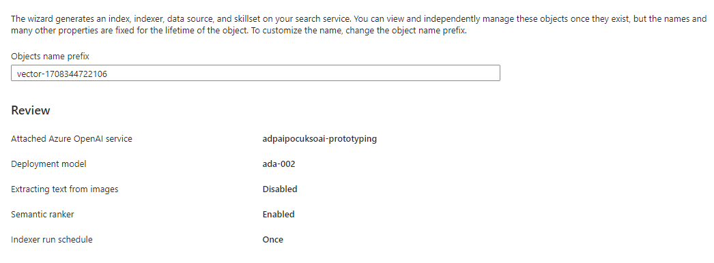

---
tags:
  - RAG
  - Semantic Search
  - Embedding
  - Vector
  - Prompt Engineering
---

# Using Custom Data with Large Language Models (LLMs) in AZURE

## Overview 

This is a walkthrough on how to use your own data with Large Language Models (LLMs), like GPT, by leveraging Azure AI Search as a vector store to use Retrieval Augmented Generation (RAG) within an LLM model.

The typical data flow will follow the ingestion of data from a datasource(s), some type of ETL process, creation of vector store and the use of the vector store with an LLM:
    

For this walkthrough there are 3 parts involved Blob Storage (document storage), Azure AI Search (vector database) and Azure OpenAI (LLM model). These all form a Hybrid and Symantic Search enviroment for RAG within an LLM model:
    

Example application flow:

This will guide through the setup of creating and configuring Blob Storage, Azure AI Search and Azure OpenAI along with how the Azure AI Studio can be used for testing.

## Walkthrough

#### 1. Create Azure Storage

The blob storage will be the storage location for the text files holding the content for the knowledge base/own data (documentation, policy documents, guidence...)

- Create a storage account:
  [Create a storage account - Azure Storage](https://learn.microsoft.com/en-us/azure/storage/common/storage-account-create?tabs=azure-portal) 
- Create a container:
  [Quickstart: Upload, download, and list blobs - Azure portal - Azure Storage](https://learn.microsoft.com/en-us/azure/storage/blobs/storage-quickstart-blobs-portal#create-a-container)

#### 2. Create Azure OpenAI Deployments

The Azure OpenAI service refers to the [integration of OpenAI](https://learn.microsoft.com/en-us/azure/cognitive-services/openai/overview)'s powerful artificial intelligence language models and services into the Microsoft Azure applications and platform.

Before configuring the Azure AI Search, a `ChatGPT` model and an `Embedding` model is required:

1. Prerequisit:
    - An Azure AI Service needs to have been created
    - An Azure OpenAI Service needs to have been created within the Azure AI Service

2. Within the Azure Open AI Service open the Azure OpenAI Studio

    

3. Within the Azure OpenAI Studio two deployments need creating with the following models:

    - gpt-35-turbo:

          1. Select `Deployments`

              

          2. Select `Create new deployment`

              

          3. Select the `gpt-35-turbo` model and a `deployment name`
          
              

    - text-embedding-ada:

          1. Select `Deployments`

              

          2. Select `Create new deployment`:
          
              

          3. Select the `text-embedding-ada` model and a `deployment name`

              

#### 3. Create and Configure Azure AI Search

1. Create an instance of Azure AI Search:
[Create a search service in the portal - Azure AI Search](https://learn.microsoft.com/en-us/azure/search/search-create-service-portal) 
> **NOTE**: When selecting the `Pricing Tier`, the `Basic` offereing is required. This is because `Symantic Ranking` is required.

2. Within the Azure AI Search Instance select `Import and vectorize data`:

    

3. Setup data connection

    

4. Vectorize and enrich data

    

    > **NOTE**: In productionthe authentication type `System assigned` to use `managed identities`.

    > **NOTE**: When selecting `Schedule indexing`, if the requirement is to schedule a re-index for, let's say, every 5 minutes, make sure there is the required scaling and “Search Units (SU)” available. Both SU are needed when querying and indexing to avoid conflicts.

5. Review and create

    

When the Azure AI Search is being created, it will create the index and run the indexer. The indexer needs to have finished before a search query can be executed.

6. To query the index within the Azure AI Search

      1. Select `Indexes` from the `Search management`

      2. Click on the Index name

      3. Enter a search term in the search box. This could be a known text within the text documents index within the `Blob Storage Container`
      
          
 

#### 4. Test within Azure OpenAI Studio

1. Within the Azure Open AI Service open the Azure OpenAI Studio

    

2. Click on `Chat`

    

3. Within configuration select to required deploment model

     

4. Enter a user query for an item of text within the document store. 

    - For example the document text I uploaded contained information regarding the `Sustainable Farming Inititive`. If we ask the Deployment model `What is SFI?` the response is:

    *”SFI stands for the Sustainable Forestry Initiative. It is an independent, non-profit organization that promotes sustainable forest management through the development of standards, certification, and conservation programs. The SFI program is based on principles that promote responsible environmental behavior and sound business practices. SFI's standards are designed to ensure that forests are managed in a way that protects wildlife, watersheds, and the overall health of forest ecosystems.”*

    This is incorrect. The reason it is incorrect is because the setup to use the vectorized data from the Azure AI Search hasn’t yet been configured for use in the Playground.

    > **NOTE**: Any configuration configured within the playground is for the playground only and has no affect on any other configuration outside.

5. Add you own data

    1. Select `Add your data` within the Setup section in the playground

        

    2. Click `Add a data source`

        

    3. Select data source:

        1. The data source is `Azure AI Search`

            

        2. Select `Azure AI Search Service`

            

        3. Select `Azure AI Search Index`

            

        4. Select `Add vector search to the search resource`

            

        5. Select an embedding model to use from the deployment in Azure OpenAI

            

        6. Tick the acknowledgement to accept there are charges

            

    4. Data Management:

        1. Select `Search type` of `Hybrid + semantic`

            

        2. Select an existing semantic search configuration

            

        3. Tick the acknowledgements

            

    5. Review and finish

        1. Save and close

            
 

6. Re-test

    - Enter a user query for an item of text within the document store. For example the document text I uploaded contained information regarding the `Sustainable Farming Inititive`. If I ask the Deployment model `What is SFI?` the response is:

    *“The Sustainable Farming Incentive (SFI) is a scheme that pays farmers for actions that support food production and can help improve farm productivity and resilience, while also protecting and improving the environment. It is being rolled out incrementally and is currently open to farmers who were eligible for the Basic Payment Scheme (BPS) on 16 May 2022. The scheme is straightforward to apply to, payments are received quickly, and it is less prescriptive, allowing farmers flexibility to focus on delivering outcomes that matter. The full offer will be in place by the start of 2025, and agreements last for three years with payments made quarterly.”*

    This is correct. Along with the response citations are returned identifing the reference data used to create the returned response. This validates the use of the “grounded data” fron the RAG.

## References

- [RAG and generative AI - Azure AI Search](https://learn.microsoft.com/en-us/azure/search/retrieval-augmented-generation-overview)
- [Semantic ranking - Azure AI Search](https://learn.microsoft.com/en-us/azure/search/semantic-search-overview)
- [Vector search - Azure AI Search](https://learn.microsoft.com/en-us/azure/search/vector-search-overview)
- [Azure OpenAI Service embeddings tutorial - Azure OpenAI](https://learn.microsoft.com/en-us/azure/ai-services/openai/tutorials/embeddings?tabs=python%2Ccommand-line&pivots=programming-language-python)
- [Prompt engineering techniques with Azure OpenAI - Azure OpenAI Service](https://learn.microsoft.com/en-us/azure/ai-services/openai/concepts/advanced-prompt-engineering?pivots=programming-language-chat-completions)

## Developer

- [npm: @azure/openai](https://www.npmjs.com/package/@azure/openai)
- [Azure OpenAI client library for JavaScript](https://learn.microsoft.com/en-us/javascript/api/overview/azure/openai-readme?view=azure-node-preview)