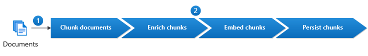

---
tags:
  - RAG
---
# RAG Implementation Guide

## Preparation Phase

### 1. Define Business Requirements

- Clearly outline the specific use cases and goals for the RAG system
- Identify key performance indicators (KPIs) to measure success

### 2. Gather Test Documents

- **Pertinence** - documents must meet the business requirements
- **Representativeness** - documents should be representative of all the types of documents that your solution will use
- **Physical document quality** - documents need to be in a usable shape, e.g. clear document scans
- **Document content quality** - documents must have high content quality, e.g. there should not be misspellings or grammatical errors

Hints:

- Remember to redact PII from real documents
- Have at least two documents for each document type
- If using synthetic documents, ensure they are as close to real data as possible
- You can use LLMs to help evaluate the document quality

### 3. Gather Test Queries

- Create a diverse set of queries covering various use cases
- Include edge cases and potential challenging scenarios

## Chunking Phase

### 1. Perform Document Analysis

- What information should be ignored or excluded?
- What information should be captured in chunks?
- How should the document be chunked? (e.g. by sentence or fixed size with overlap)

### 2. Choose Chunking Method

- **Sentence-based parsing** - breaks text into chunks of complete sentences
- **Fixed-size parsing (with overlap)** - breaks text into fixed-size chunks with overlap
- **Custom code** - uses text parsing techniques like regex 
- **LLM augmentation** - generates textual representations of images or summaries of tables using LLM 
- **Document layout analysis** - combines OCR with deep learning to extract document structure and text
- **Prebuilt model** - uses models pre-trained for specific document types or genres
- **Custom model** - uses custom models for structured documents where no prebuilt model exists
- **Manual** - uses human-curated chunks

| Method                   | Tool Examples                                                                             | Effort | Processing Cost |
|:------------------------ |:----------------------------------------------------------------------------------------- |:------ |:--------------- |
| Sentence-based parsing   | <ul><li>SpaCy sentence tokenizer</li><li>NLTK sentence tokenizer</li></ul>                | Low    | Low             |
| Fixed-size parsing       | <ul><li>LangChain recursive text splitter</li><li>Hugging Face chunk visualizer</li></ul> | Low    | Low             |
| Custom code              | <ul><li>Python (re, regex, BeautifulSoup)</li><li>R (stringr, xml2)</li></ul>             | Medium | Low             |
| LLM augmentation         | <ul><li>Azure OpenAI</li><li>OpenAI</li></ul>                                             | Medium | High            |
| Document layout analysis | <ul><li>Azure AI Document Intelligence</li><li>Donut</li></ul>                            | Medium | Medium          |
| Prebuilt model           | <ul><li>Azure AI Document Intelligence</li><li>Power Automate</li></ul>                   | Low    | Medium/High     |
| Custom model             | <ul><li>Azure AI Document Intelligence</li><li>Tesseract</li></ul>                        | High   | Medium/High     |
| Manual                   | <ul><li>Human reviewers</li><li>LabelStudio</li></ul>                                     | High   | Low             |

## Enrichment Phase

### 1. Clean Chunks

- Lowercase text - embeddings are usually case-sensitive meaning "Cheetah" and "cheetah" would result in a different vector despite having the same logical meaning
- Remove stop words - removing stop words like "a", "an" and "the" would allow both "a cheetah is faster than a puma" and "the cheetah is faster than the puma" to both be vectorially equal to "cheetah faster than puma."
- Fix spelling mistakes
- Remove unicode characters
- Normalisation (expand abbreviations, convert numbers to words, expand contractions)

### 2. Augment Chunks with Metadata

Metadata can help filter the chunks prior to the semantic search or be used as part of it. 

Examples of metadata fields:

- Title
- Summary
- Keywords
- Source
- Language
- Questions that the chunk can answer

## Embedding Phase

### 1. Choose Embedding Model

- [Hugging Face Leaderboard](https://huggingface.co/spaces/mteb/leaderboard)

### 2. Evaluate Embedding Model

- Visualise your embeddings using tools such as [t-SNE from Scikit-learn](https://scikit-learn.org/stable/modules/generated/sklearn.manifold.TSNE.html)
- Calculate embedding distances using [Euclidean](https://www.datacamp.com/tutorial/euclidean-distance) or [Manhattan distance](https://www.datacamp.com/tutorial/manhattan-distance)

## Persisting Phase

Vector storage Examples:

    - Pure vector databases: Pinecone, Weaviate
    - Full-text search databases: Elasticsearch, OpenSearch
    - Vector-capable SQL databases: PostgreSQL with pgvector
    - Vector-capable NoSQL databases: MongoDB

## Retrieval Phase

### 1. Implement Semantic Search

- Choose between approximate nearest neighbor (ANN) or exact nearest neighbor search based on performance requirements
- Implement hybrid search combining semantic and keyword-based approaches for improved results

### 2. Fine-tune Retrieval

- Experiment with different similarity thresholds
- Implement re-ranking strategies to improve relevance of retrieved chunks

## Conclusion

Implementing a successful RAG solution requires careful consideration of each phase, from preparation to evaluation. By following this guide, you can create a robust and effective RAG system tailored to your specific needs.

## References

- [Azure RAG Guidelines](https://learn.microsoft.com/en-us/azure/architecture/ai-ml/guide/rag/rag-solution-design-and-evaluation-guide)
- [Euclidean Distance](https://www.datacamp.com/tutorial/euclidean-distance)
- [Manhattan Distance](https://www.datacamp.com/tutorial/manhattan-distance)