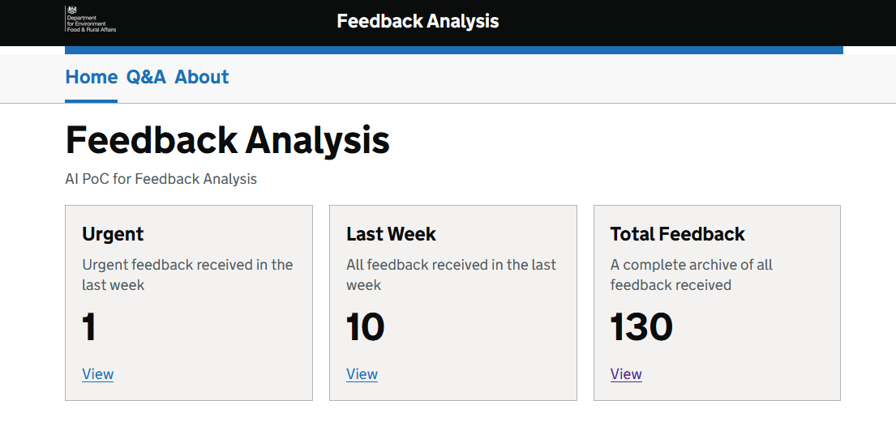
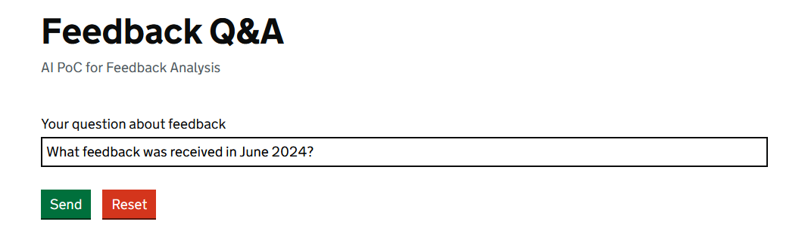
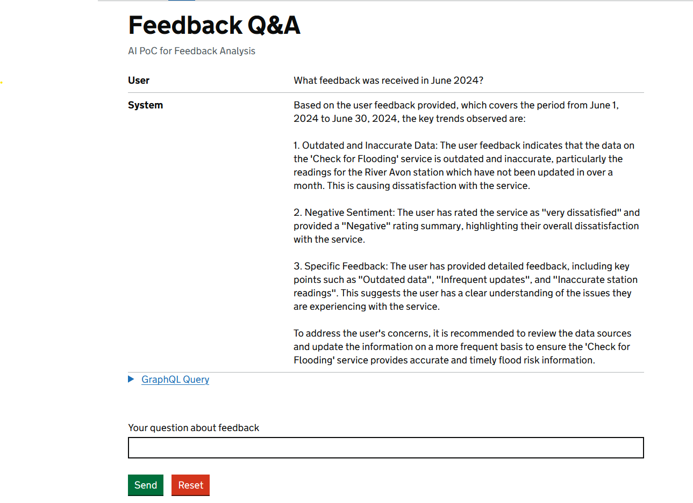
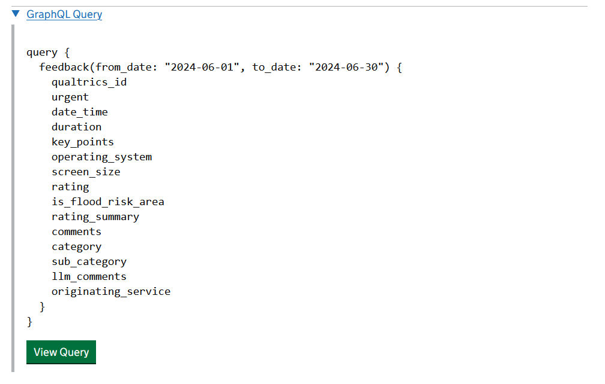
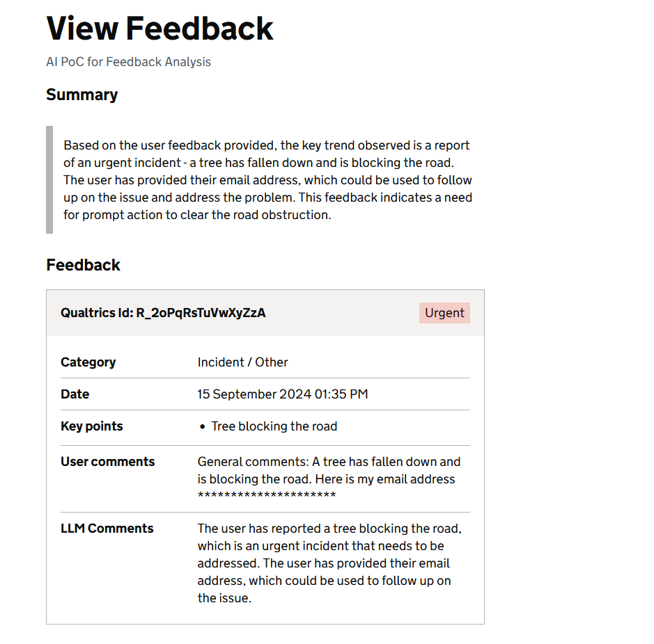

---
tags:
  - LangChain
---

# Feedback Triage

## Overview

The Feedback Triage is a Proof of Concept (PoC) system that transforms user feedback into actionable insights.

This PoC automates processing of user feedback, using LLM to enrich and transform raw user feedback into easily queryable data.

## Features

- Feedback Analysis Dashboard that displays feedback numbers from last week and total
- Feedback Q&A: utilizes Agent's GraphQL query building capabilities to retrieve relevant data and then use it to generate answer to user's query
- Raw Feedback Enrichment leverages LLM to:
    - generate feedback summary
    - extract its key points
    - assign a category and subcategory from predetermined ones
    - mark it `urgent` if necessary

## Gallery

-   Feedback Q&A

    

-   Feedback Q&A Response

    

-   GraphQL Query generated by LLM

    

<figure markdown="span">

  <figcaption>Enriched Feedback</figcaption>

  { width="600" }

</figure>