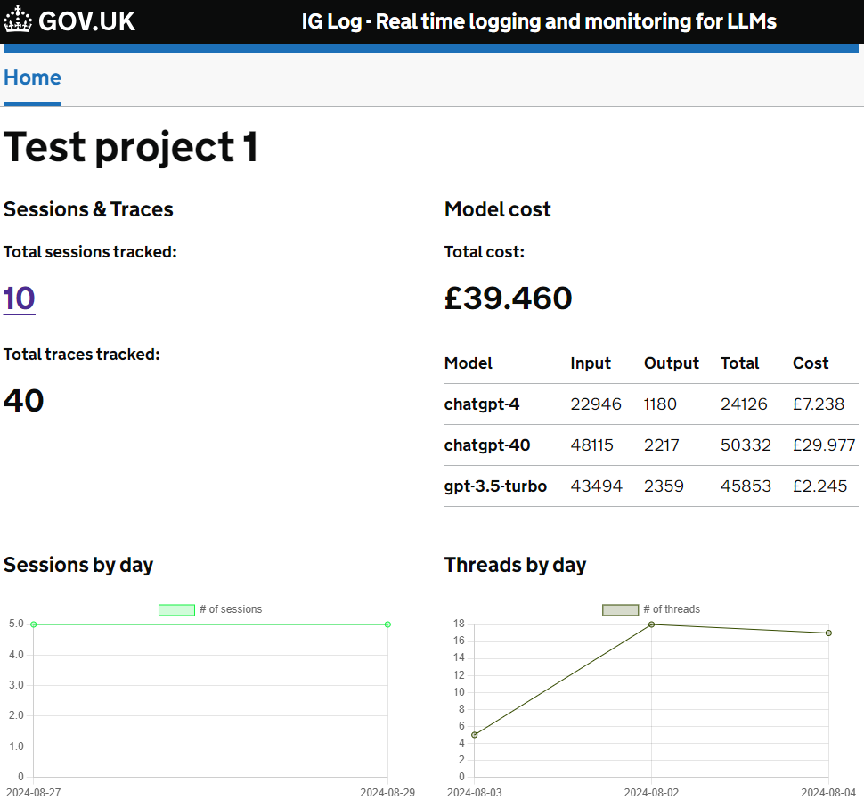
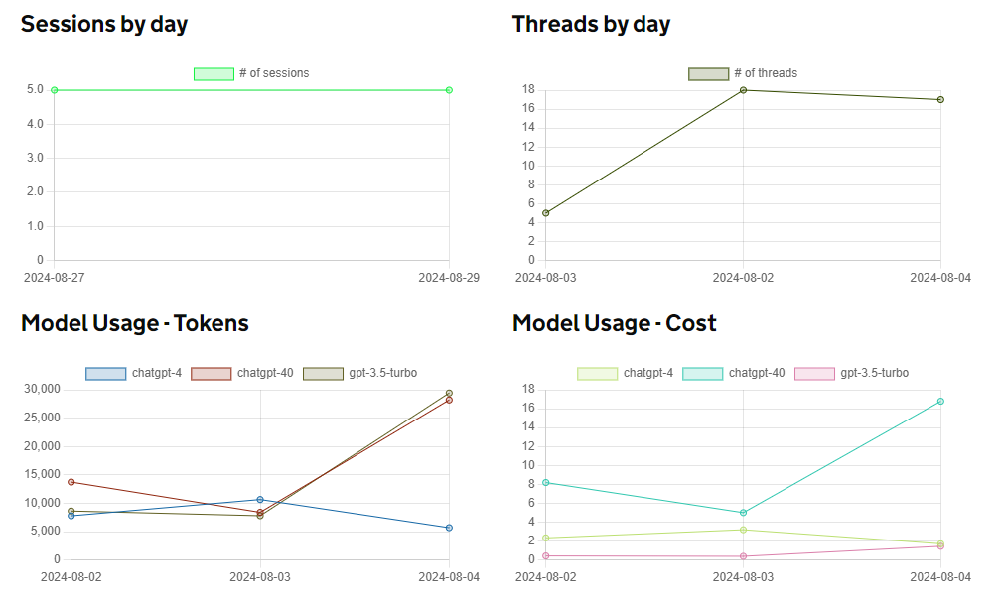
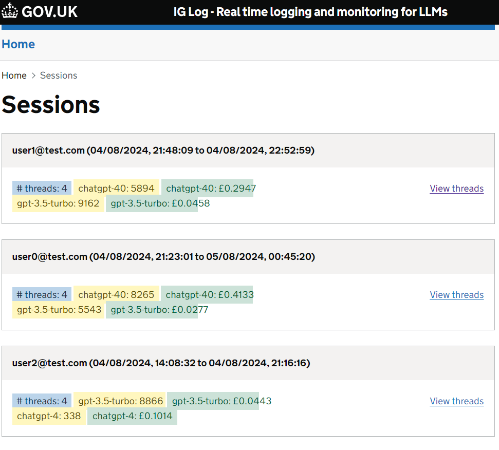
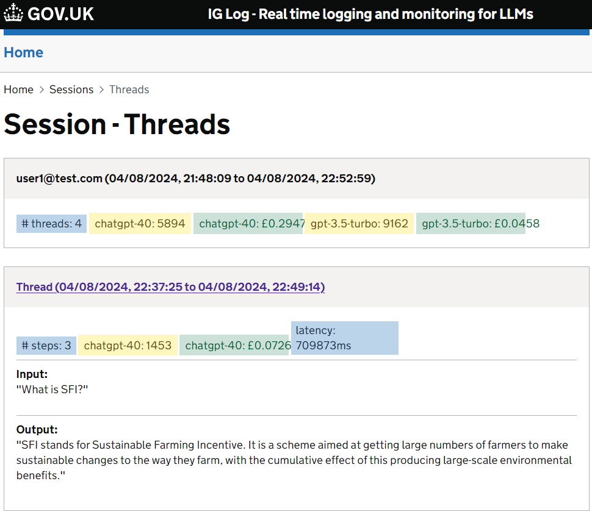
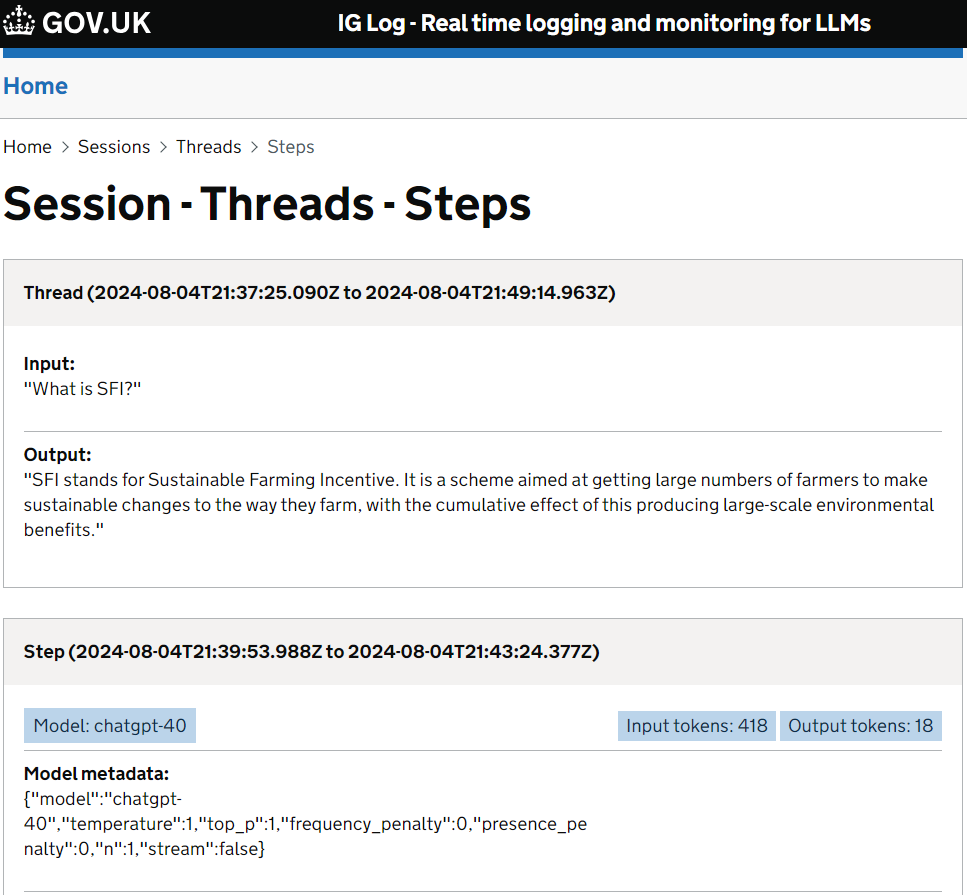

# IG Log

## Overview
The IG Log is a Proof of Concept (PoC) LLM observation platform that provides metrics and insights into the use and performance of LLMs across various projects.

## Features

- Provides a dashboard for monitoring LLM usage, latency and cost across a project
- LangChain integration
- Collation of LLM usage, latency and cost data

## Gallery

<figure markdown="span">

  <figcaption>Dashboard</figcaption>

  { width="600" }

</figure>

<figure markdown="span">

  <figcaption>Graphs</figcaption>

  { width="600" }

</figure>

-   Sessions

    

-   Threads

    

-   Steps

    

## Github Repos
- [ai-ig-log-frontend](https://github.com/DEFRA/ai-ig-log-frontend)
- [ai-ig-log-api](https://github.com/DEFRA/ai-ig-log-api)