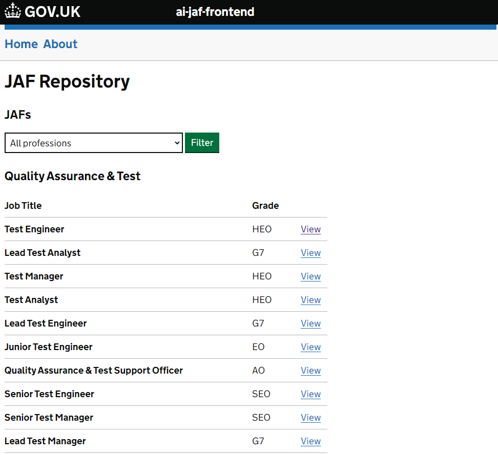
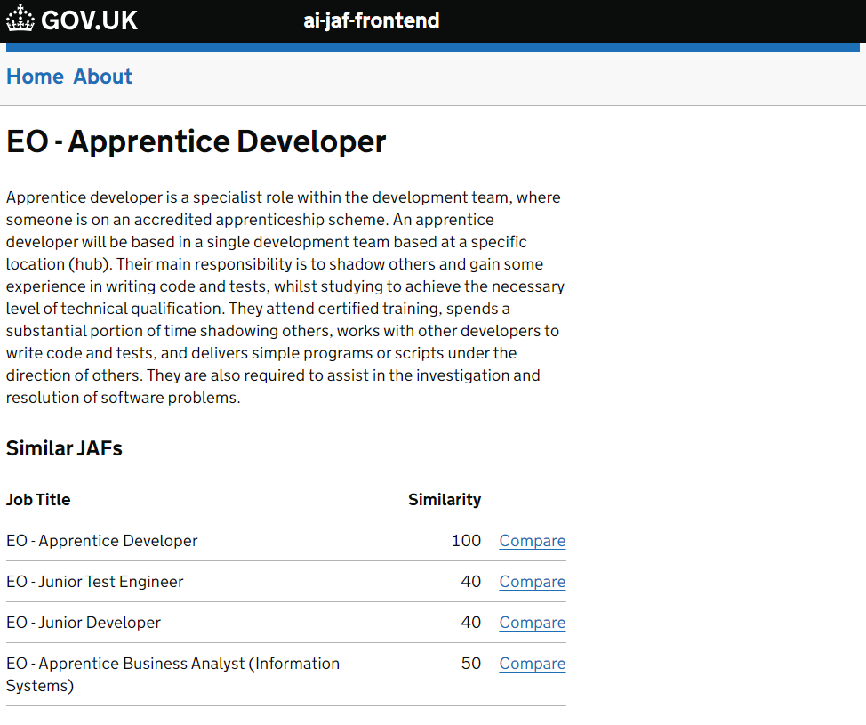
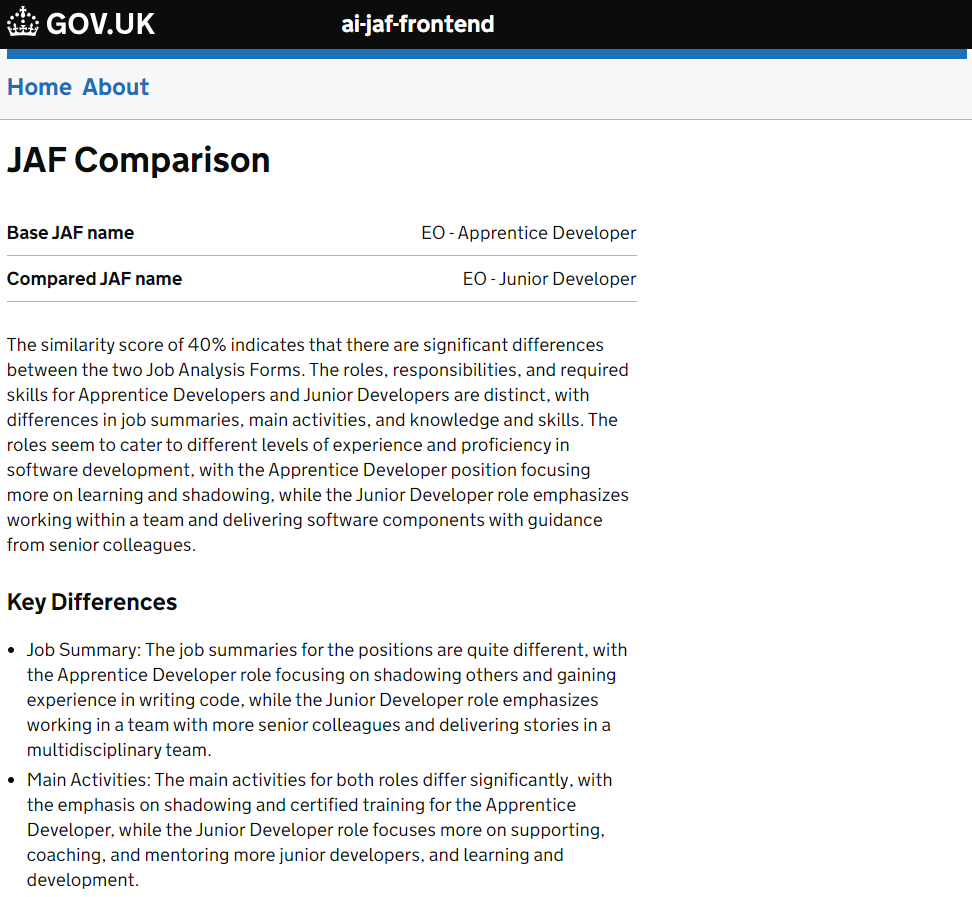

---
tags:
  - LangChain
  - Azure OpenAI
---

# JAF Analysis

## Overview
The JAF Analysis project is a Proof of Concept (PoC) system that showcases how LLMs can be used to assist in the comparison of JAFs (Job Analysis Forms) to identify similarities and differences between roles.

# Features
- Uses Azure OpenAI GPT3.5 LLM to compare JAFs
- Provides a searchable database of JAFs
- Allows users to compare job roles and identify similarities and differences

## Gallery

<figure markdown="span">

  <figcaption>Repository</figcaption>

  { width="600" }

</figure>

<figure markdown="span">

  <figcaption>JAF Analysis</figcaption>

  { width="600" }

</figure>

<figure markdown="span">

  <figcaption>Comparison</figcaption>

  { width="600" }

</figure>

## Github Repository
- [ai-jaf-frontend](https://github.com/DEFRA/ai-jaf-frontend)
- [ai-jaf-backend](https://github.com/DEFRA/ai-jaf-backend)
- [crai-jaf-backend](https://github.com/DEFRA/crai-jaf-backend)
