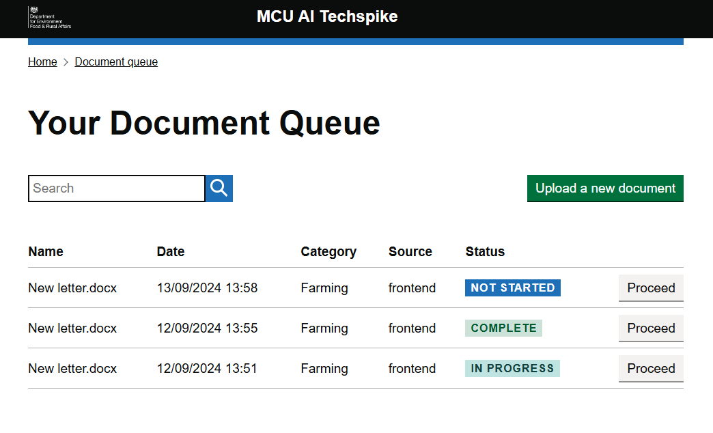
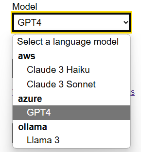
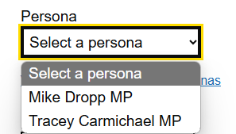
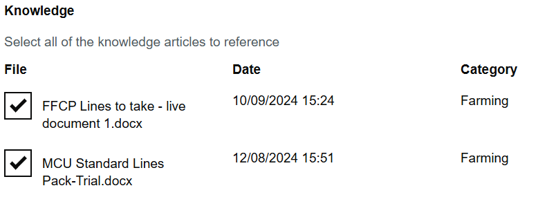
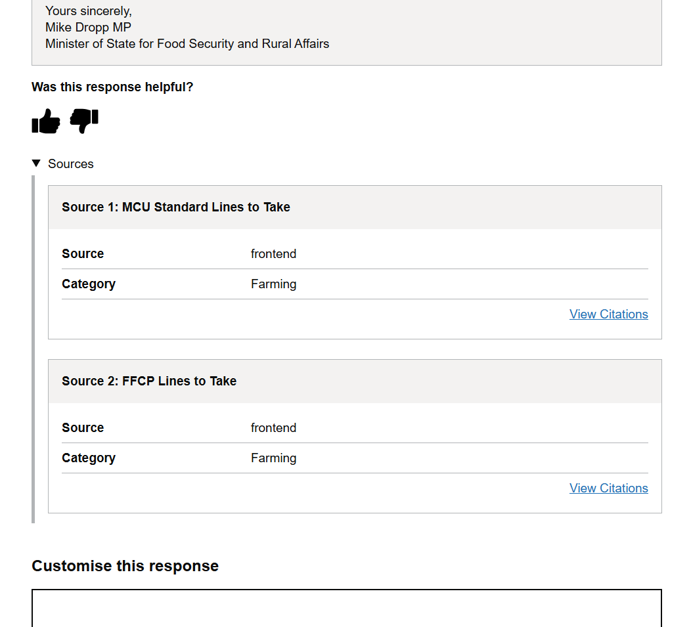

---
tags:
  - LangChain
---

# Ministerial Correspondence

## Overview

The MCU AI project is a Proof of Concept (PoC) LLM system that showcases how large language models could be used to enhance the handling of ministerial communications. 

It aims to:

- Triage documents to extract key facts and generate summary
- Automate initial drafts of responses
- Reduce administrative workload for correspondence drafters

## Features

- Triages and summarises received correpondence using an LLM
- Retrieval Augmented Generation (RAG) to generate responses based on policy documents
- Built to accomodate a range of LLMs from various providers:
    - Azure OpenAI
    - Amazon Bedrock
    - Ollama (for local deployment)
- Uses custom personas to tailor response tone and language
- Supports full audit capabilities via response history page and IG Log

## Gallery

-   LLM Selection

    

-   Persona Selection

    

-   Knowledge Selection

    

-   Sources

    

<figure markdown="span">

  <figcaption>Response History</figcaption>

  { width="600" }

</figure>

## Github Repos

- [DEFRA/coreai-mcu-core](https://github.com/DEFRA/coreai-mcu-core)