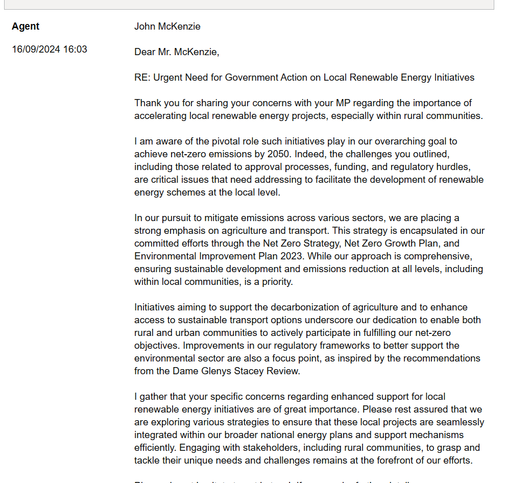
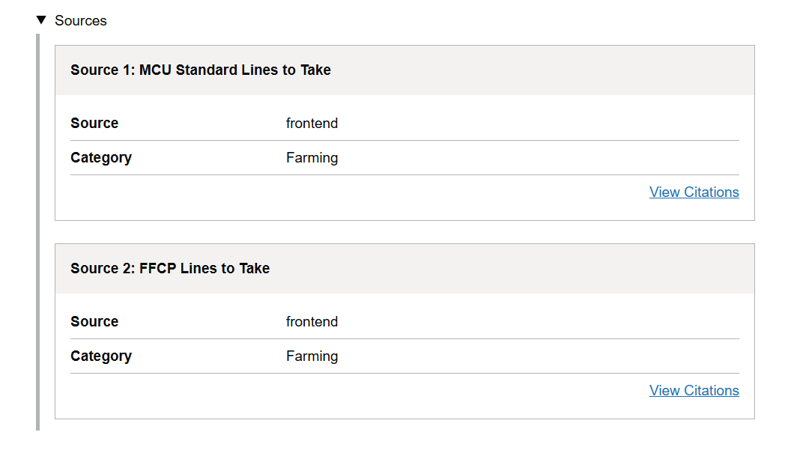

---
tags:
  - LangChain
---

# Ministerial Correspondence

## Overview

The Ministerial Correspondence Unit is a sophisticated tool designed to streamline the management and response of documents and communications directed towards ministers, by leveraging advanced language models to automate initial response drafts, thus reducing the administrative burden on staff.

## Features

### Upload documents

This system allows users to upload emails and letters received from the public or other stakeholders that are then triaged by the system to:

- generate summary
- extract key points and facts 
- analyse its sentiment

Additionally, users can upload a variety of documents that serve as knowledge repositories for language models to be used in generating responses.

-   Upload knowledge:

    

-   Upload document:

    

### Document queue

Uploaded documents with their respective status will be displayed here:

### View triaged document

Uploaded document can then be viewed and selected to generate a response to it:

### Generate response

When a user clicks `Generate response`, it will take them to the `Document Response` page, where the full document then can be viewed:

At the bottom of the page, a user can choose which model and personas should be used for generating a response, as well as select which knowledge should be accessed:

### Review and customise generated response

The system allows a user to view the generated response:

The user can also view sources and citations used to generate the response:

The user can then prompt the language model to adjust the response:

Once a user is happy with the response, it can then be finalised:

## Github Repos

- [DEFRA/coreai-mcu-core](https://github.com/DEFRA/coreai-mcu-core)