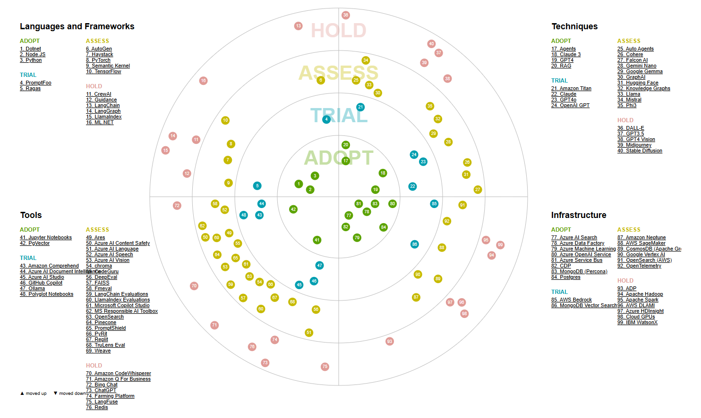

# Tech Radar

> **NOTE**: The tech radar is an independent radar from the tools authority. For any tools, framework, etc... set as adopt, may still need to be taken through the tools authority for strategic adoption into Defra. This tech radar is used by the AI development team for tracking purposes only. Please consult with the tools authority for the use of AI and Data tools, frameworks, etc...  before proceeding in its use.

> **NOTE**: As of **20-08-2024**