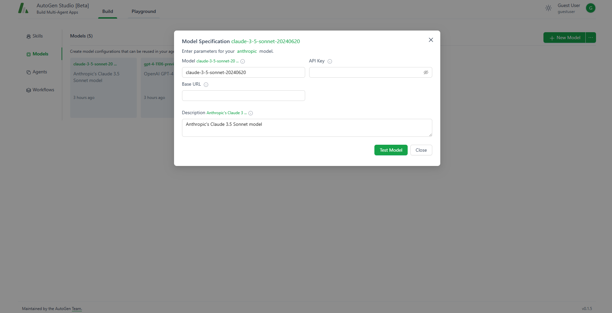
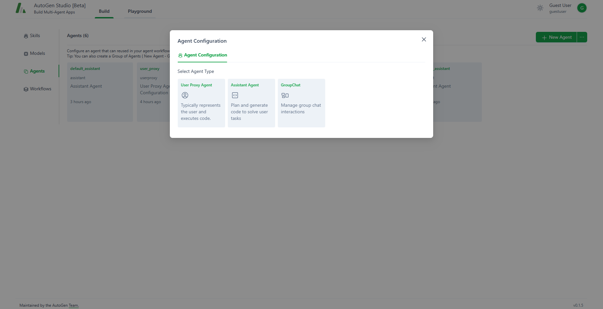

---
tags:
  - LLM
---
# AutoGen Studio 2.0

<div class="grid cards" markdown>

-   :material-radar:{ .lg .middle } __Techradar__

    ---

    Assess

-   :material-thumb-up:{ .lg .middle } __Recommendation__

    ---

    Continue with assessment

</div>

## Overview

AutoGen Studio 2.0 by Microsoft is an advanced AI development tool designed to streamline the creation and management of AI agents and workflows. It offers a user-friendly interface with sections for building AI agents, testing their behavior, and storing development sessions. The platform integrates with language models like OpenAI, Azure and Claude through API keys and provides a Python API for detailed workflow control. Suitable for both novice and expert developers, AutoGen Studio 2.0 is a versatile solution in the realm of AI innovation.

## Prerequisites

- `Python 3.11`: AutoGen Studio UI 2.0 is designed to run on `Python 3.11`. Installing this specific version is essential to ensure compatibility and optimal performance. If you have more than one version of Python installed, you can easily switch between them using `pyenv`.

- **LLM Providers and API Keys**: To access the capabilities of LLMs, you’ll need an API key. either an `OPENAI_API_KEY` or an `AZURE_OPENAI_API_KEY`. These keys serve as your access pass to the language models provided by OpenAI or Azure.

## Setup

Create a `.env` file with API keys:

``` basic title="example"
export AZURE_OPENAI_API_KEY="your_azure_api_key_here"
```

## Installation

Install AutoGen Studio Package:

``` bash
pip install autogenstudio
```

If using `poetry`, you may need to update dependencies in `pyproject.toml`:
``` toml title="pyproject.toml example"
[tool.poetry.dependencies]
python = ">=3.11,<3.13"
```

## Launch

1. Start user interface by typing in your terminal:

    ``` bash
    autogenstudio ui
    ```

2. Access AutoGen Studio

    Using your preferred browser, navigate to `http://localhost:8081/`. This is the URL where AutoGen Studio is running.

    You should see something like this:

    

## AutoGen Studio Features

### Build Section

The build section allows you to create skills, agents and workflows, as well as define models. Each section should come populated with some examples to give an idea how to create your own.

#### Skills 

Skills are custom python functions that can be leveraged by agents.


``` py linenums="1" title="skill example"
from typing import List
import uuid
import requests
from pathlib import Path

from openai import OpenAI


def generate_and_save_images(query: str, image_size: str = "1024x1024") -> List[str]:
    """
    Function to paint, draw or illustrate images based on the users query or request. 
    Generates images from a given query using OpenAI's DALL-E model and saves them to disk.  
    Use the code below anytime there is a request to create an image.

    :param query: A natural language description of the image to be generated.
    :param image_size: The size of the image to be generated. (default is "1024x1024")
    :return: A list of filenames for the saved images.
    """

    # Initialize the OpenAI client
    client = OpenAI()
    # Generate images
    response = client.images.generate(model="dall-e-3", prompt=query, n=1, size=image_size)

    # List to store the file names of saved images
    saved_files = []

    # Check if the response is successful
    if response.data:
        for image_data in response.data:
            # Generate a random UUID as the file name
            file_name = str(uuid.uuid4()) + ".png"  # Assuming the image is a PNG
            file_path = Path(file_name)

            img_url = image_data.url
            img_response = requests.get(img_url)
            if img_response.status_code == 200:
                # Write the binary content to a file
                with open(file_path, "wb") as img_file:
                    img_file.write(img_response.content)
                    print(f"Image saved to {file_path}")
                    saved_files.append(str(file_path))
            else:
                print(f"Failed to download the image from {img_url}")
    else:
        print("No image data found in the response!")

    # Return the list of saved files
    return saved_files


# Example usage of the function:
# generate_and_save_images("A cute baby sea otter")
```

#### Models

Models represent configurations of large language models (LLM). Like skills, models can be linked to an agent specification. AutoGen Studio supports various model types, including OpenAI models, Azure OpenAI models, and Gemini models, as well as any other model provider that adheres to the OpenAI endpoint specification.



#### Agents
Agents specify properties for an AutoGen agent, like `System Message`, `Temperature`, `Max Tokens`, `Agent Default Auto Reply`, as well as which models and skills the agent can use. Currently `UserProxyAgent` and `AssistantAgent` and `GroupChat` agent abstractions are supported:



After Choosing an agent type, you can specify its properties:


#### Workflows

An agent workflow defines how a team of agents collaborates to complete a task. AutoGen Studio supports two primary workflow patterns:

1. **Autonomous Chat**

    This workflow involves initiating a conversation between agents to accomplish a task. In AutoGen Studio, you define an initiator agent and a receiver agent, with the receiver selected from a list of previously created agents. If the receiver is a GroupChat agent (containing multiple agents), the communication pattern among those agents is controlled by the `speaker_selection_method` parameter in the GroupChat agent configuration.

    

2. **Sequential Chat**

    In this workflow, users specify a list of `AssistantAgent` agents that execute sequentially to complete a task. During runtime, each `AssistantAgent` is paired with a `UserProxyAgent` and engages in a chat to process the input task. The result of each exchange is summarized and passed to the next `AssistantAgent` in the sequence, along with its `UserProxyAgent`. This process continues until the final `AssistantAgent` in the sequence completes the task.

    

### Playground

Using playground, users can interactively test workflows on tasks and review resulting artifacts (such as images, code, and documents)

#### Example

1. Configure a model (in this case Azure OpenAI) to be used by our agents:

    

2. After configuring a model with our API key, we can now define agents:

    <div class="grid cards" markdown>

    -   user_proxy:

        

    -   travel_groupchat:

        

    -   local_assistant:

        

    -   planner_assistant:

        

    -   language_assistant:

        
    </div>
    
        and assign models to them:
        
        

        Now we'll tell the agent what other agents it can communicate with:

        

3. It's time to link everything up in a workflow:

    

    

4. We now go to the playground tab and create a session with the new workflow:

    

5. Now we are ready to test our workflow:

    

    

## References

- [Official Autogen Studio 2.0 website](https://autogen-studio.com/autogen-studio-ui)
- [Official Autogen Studio docs](https://microsoft.github.io/autogen/docs)