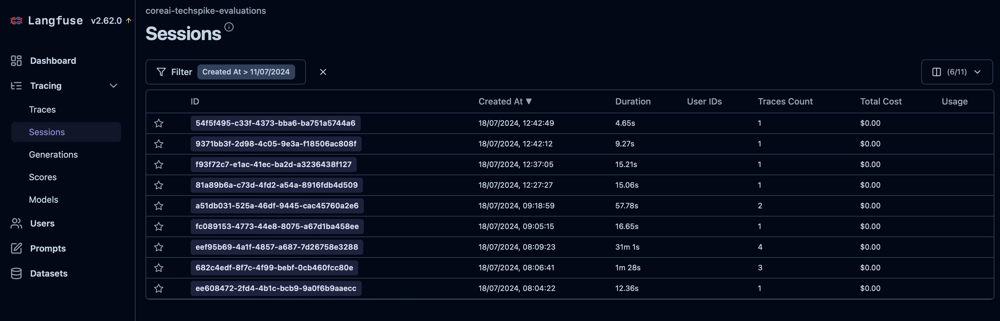
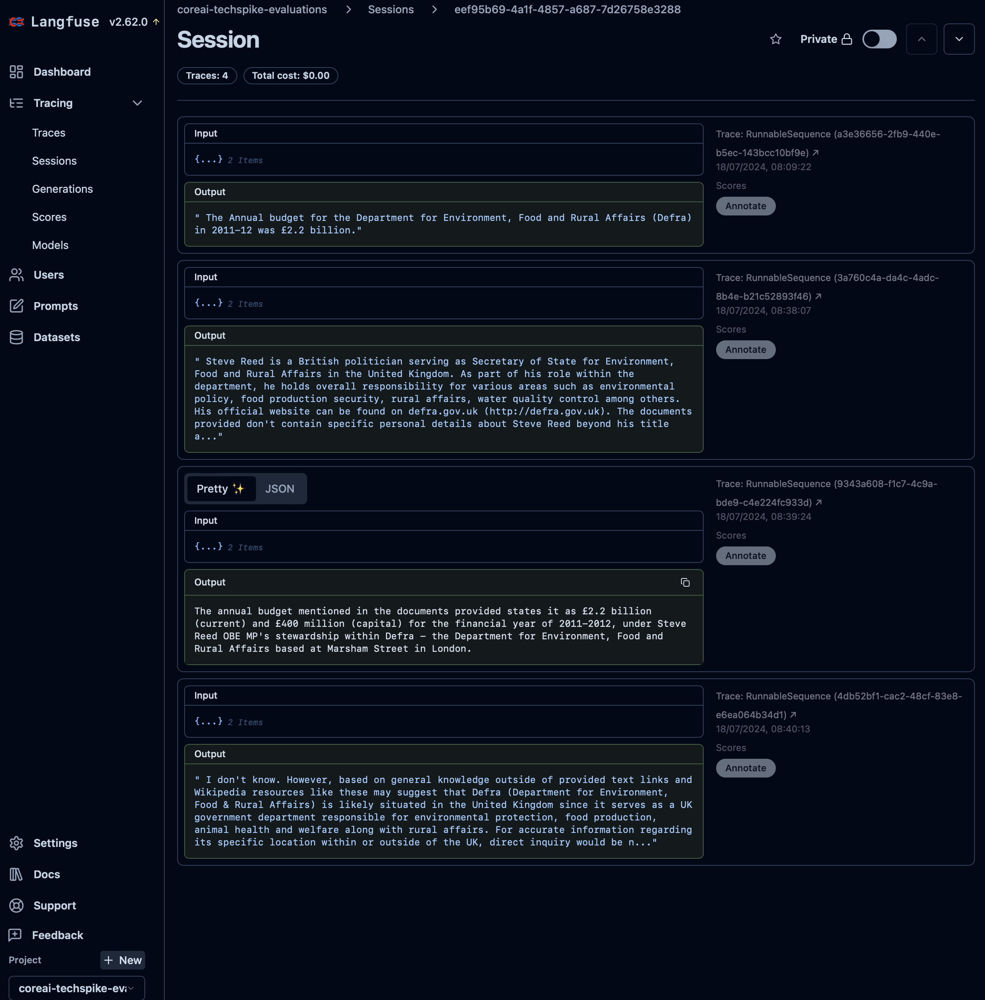
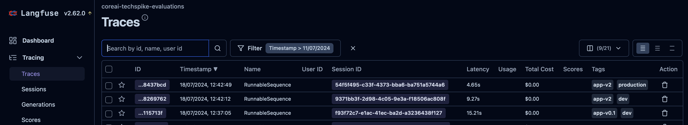
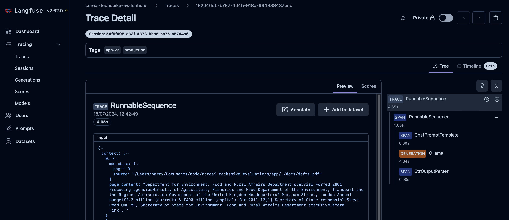
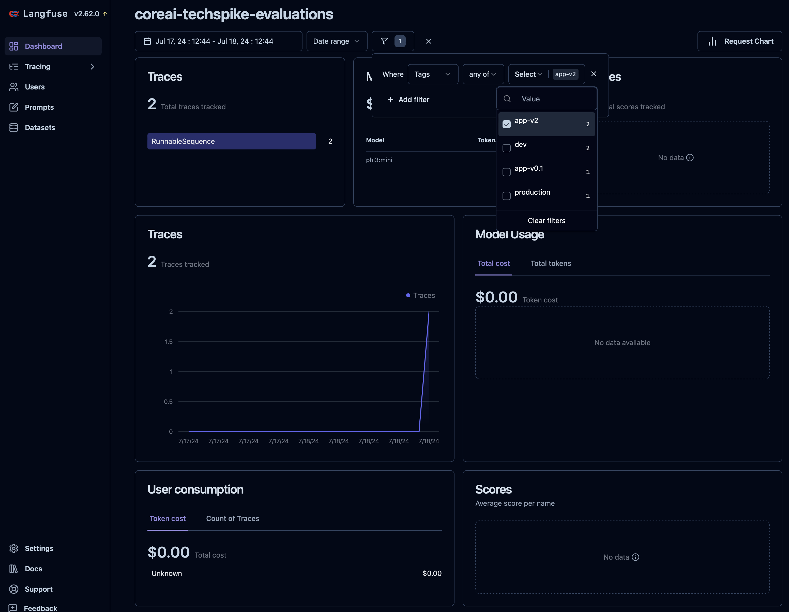

---
tags:
  - Evaluation
---

# LangFuse

<div class="grid cards" markdown>

-   :material-radar:{ .lg .middle } __Techradar__

    ---

    Archived

-   :material-thumb-up:{ .lg .middle } __Recommendation__

    ---

    Do not adopt

</div>

> **NOTE**: This page is for reference  **only**. Due to the licence changes of LangFuse it **cannot** be used.

## Overview

Langfuse is an open-source LLM engineering platform that helps teams collaboratively debug, analyze, and iterate on their LLM applications.

## Features

### Traces

A `trace` typically represents a single request or operation. It contains the overall input and output of the function, as well as metadata about the request, such as the user, the session, and tags.

Each trace can contain multiple `observations` to log the individual steps of the execution.

`Observations` are of different types:

- `Events` are the basic building blocks. They are used to track discrete events in a trace.
- `Spans` represent durations of units of work in a trace.
- `Generations` are spans used to log generations of AI models. They contain additional attributes about the model, the prompt, and the completion. For generations, [token usage and costs](https://langfuse.com/docs/model-usage-and-cost) are automatically calculated.

### Sessions

User interactions with LLMs have the potential to span multiple traces. Langfuse provides sessions as a way to group these traces together and see a simple session replay of the entire interaction.

Implementing sessions in Langfuse / Langchain is straightforward:

1. A unique identifier is needed and will be used as a `session_id`. The UUID library can be used for this and implemented as follows:
``` py linenums="1"
import uuid
session_id = str(uuid.uuid4())
```

2. The `session_id` can then be added to the Langfuse callback handler:
``` py linenums="1"
langfuse_handler = CallbackHandler(
  ...
  session_id = session_id
)
```

3. Ensure the Langfuse callback handler is being used by the Langchain chain.invoke function:
``` py linenums="1"
result = chain.invoke(..., config = { "callbacks": [langfuse_handler] }) 
```

4. In the Langfuse *Dashboard* → *Tracing* → *Sessions* section a list of `sessions` will be displayed:

    

5. Selecting a `session` in the list enables you to drill down into the various inputs, context, meta data, content and outputs for each query:

    

    **Example Code:** [Repo](https://github.com/DEFRA/coreai-techspike-evaluations/blob/dfefd1cde1e05aa9491fd430b1c5e985ffe0b0bc/app/app.py#L17)

    **Related Docs:** [Docs](https://langfuse.com/docs/tracing-features/sessions)

### Tags

Tags enable categorization and filtering of traces.

Implementation requires an additional `tags` field to be added to the Langfuse callback handler function.

``` py linenums="1"
langfuse_handler = CallbackHandler(
  ...,
  tags = [
    "dev",
    "app-v0.1"
  ]
)
```

The `tags` are then displayed in Traces list in the Langfuse dashboard:



They are also displayed in the Trace details screen:



You can also filter dashboard data by tags:



## References

- [Sessions](https://langfuse.com/docs/tracing-features/sessions)
- [Traces](https://langfuse.com/docs/tracing)