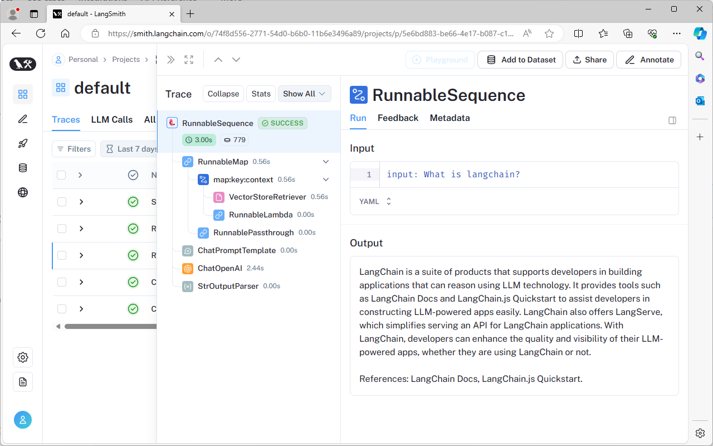

---
tags:
  - Evaluation
---

# LangSmith

<div class="grid cards" markdown>

-   :material-radar:{ .lg .middle } __Techradar__

    ---

    Archived

-   :material-thumb-up:{ .lg .middle } __Recommendation__

    ---

    Do not adopt

</div>

> **NOTE**: This page is for reference **only**. Due to the licence and data protection LangSmith **cannot** be used.

## Overview

LangSmith is a freemium addition to Langchain that provides visibility on how your Langchain code is interacting with LLMs.

## Usage

1. Sign up for an account at [langchain.com](https://www.langchain.com/).
2. Generate an API key - once logged in, click the settings (gear icon) and choose Create API Key. Copy this key.
3. Set required environment variables:
``` dosini linenums="1"
export LANGCHAIN_TRACING_V2=true
export LANGCHAIN_ENDPOINT=https://api.smith.langchain.com
export LANGCHAIN_API_KEY=<your-api-key>
```
4. Run your code as normal, traces will be sent to Langsmith for online inspection.

Traces are available to view with each step outlined:

