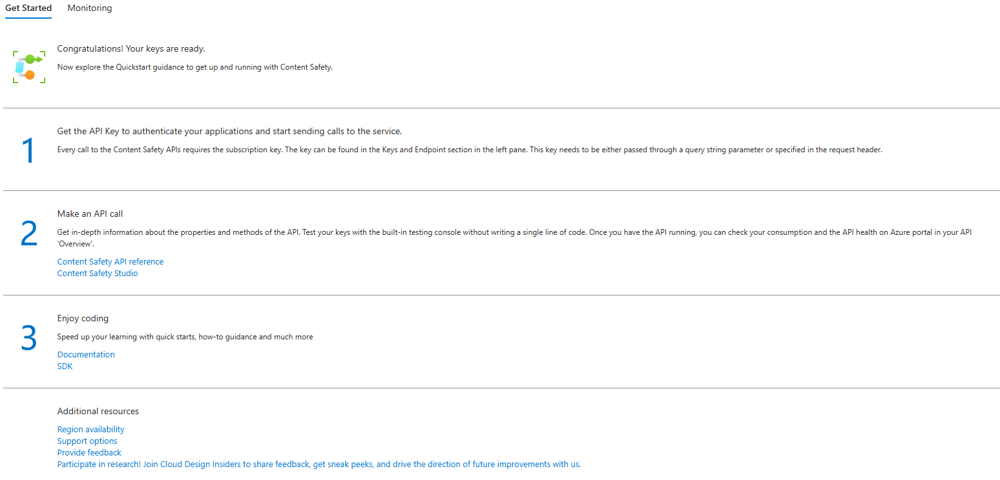

---
tags:
  - Azure
---

# Azure AI Content Safety

## Overview

Azure AI Content Safety provides tools to detect and moderate harmful content in both text and images. It includes APIs for analyzing content, as well as an interactive Content Safety Studio where developers can explore, test, and implement content moderation strategies. This service ensure that applications comply with regulations and maintain a positive user experience.

## Key Features

1. Text and Image Moderation APIs

    - **Analyze Text API:** Scans text for harmful content such as sexual content, violence, hate speech, and self-harm, with multi-severity levels.

    - **Analyze Image API:** Evaluates images for the same categories of harmful content, ensuring that visual content adheres to safety standards.

2. Prompt Shields (Preview)

    - Protects Large Language Models (LLMs) from user input attacks by scanning text prompts for potential risks.

3. Groundedness Detection (Preview)

    - Ensures that text responses from LLMs are grounded in source materials provided, improving the reliability of AI-generated content.

4. Protected Material Detection (Preview)

    - Detects known content within AI-generated text, such as copyrighted materials, ensuring that your outputs remain original.

5. Custom Categories API (Preview)

    - Allows the creation of custom content categories and scanning of text and images for specific, emerging harmful patterns.

6. Content Safety Studio

    - An online tool that enables developers to set up and manage content moderation workflows. It supports both out-of-the-box and custom blocklists, allowing you to tailor the     moderation process to your specific needs.

## Getting Started with Azure AI Content Safety

## Security and Access Control

Security is a priority in Azure AI Content Safety, with features like:

- **Microsoft Entra ID and Managed Identity:** Securely manage access to your content safety resources.

- **Data Encryption:** Protect your data at rest with Customer-Managed Keys (CMK), giving you control over encryption and access.

## Pricing and Service Limits

1. Azure AI Content Safety offers a tiered pricing structure:

    - **F0 Tier:** Basic access for smaller projects.
    - **S0 Tier:** Enhanced access for larger deployments.
    Refer to the [Azure pricing page](https://azure.microsoft.com/en-us/pricing/details/cognitive-services/content-safety/) for detailed pricing information.

2. Service Limits

    Each API has specific input requirements and rate limits. For instance:

    - **Analyze Text API:** Supports up to 10,000 characters per request.
    - **Analyze Image API:** Accepts images up to 4 MB in size.
      For a full list of limits, refer to the [official documentation](https://azure-ai-content-safety-api-docs.developer.azure-api.net/apis).

## References

- [API Documentation](https://azure-ai-content-safety-api-docs.developer.azure-api.net/apis)