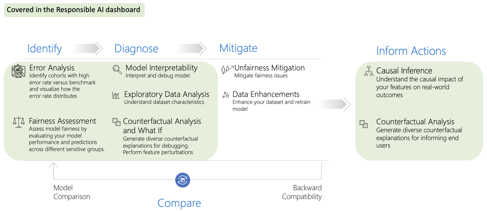

---
tags:
  - Azure
---

# Azure Responsible AI tools

## Key Features

- **Prompt Shields**: detects and blocks prompt injection attacks, including a new model for identifying indirect prompt attacks before they impact your model

- **Groundedness Detection** (coming soon): Detects “hallucinations” in model outputs

- **Safety system messages** (coming soon): Steers your model’s behavior toward safe, responsible outputs

- **Safety evaluations** (available in preview): Assesses an application’s vulnerability to jailbreak attacks and to generating content risks

- **Risks and safety monitoring** (available in preview in Azure OpenAI Service): Helps understand what model inputs, outputs, and end users are triggering content filters to inform mitigations
    
## Responsible AI Toolbox

Responsible AI Toolkit is a suite of tools providing a collection of model and data exploration and assessment user interfaces and libraries that enable a better understanding of AI systems. These interfaces and libraries empower developers and stakeholders of AI systems to develop and monitor AI more responsibly, and take better data-driven actions.

The tools are available via open source on [GitHub](https://github.com/microsoft/responsible-ai-toolbox?culture=en-us&country=us) or can be accessed through the Azure Machine Learning platform.

- [Repo: Responsible AI Toolbox](https://github.com/microsoft/responsible-ai-toolbox?culture=en-us&country=us)
- [azureml-examples/sdk/python/responsible-ai at main · Azure/azureml-examples](https://github.com/Azure/azureml-examples/tree/main/sdk/python/responsible-ai)
- [8 part blog post - Getting started with Azure Machine Learning Responsible AI components](https://techcommunity.microsoft.com/t5/ai-machine-learning-blog/getting-started-with-azure-machine-learning-responsible-ai/ba-p/3746948?WT.mc_id=aiml-114127-cxa)

## Responsible AI Dashboard

Enables you to easily flow through different stages of model debugging and decision-making. This customizable experience can be taken in a multitude of directions, from analyzing the model or data holistically, to conducting a deep dive or comparison on cohorts of interest, to explaining and perturbing model predictions for individual instances, and to informing users on business decisions and actions.

## Responsible AI Scorecard

An Azure Machine Learning Responsible AI scorecard is a PDF report that's generated based on Responsible AI dashboard insights and customizations to accompany your machine learning models. You can easily configure, download, and share your PDF scorecard with your technical and non-technical stakeholders to educate them about your data and model health and compliance, and to help build trust. You can also use the scorecard in audit reviews to inform the stakeholders about the characteristics of your model.