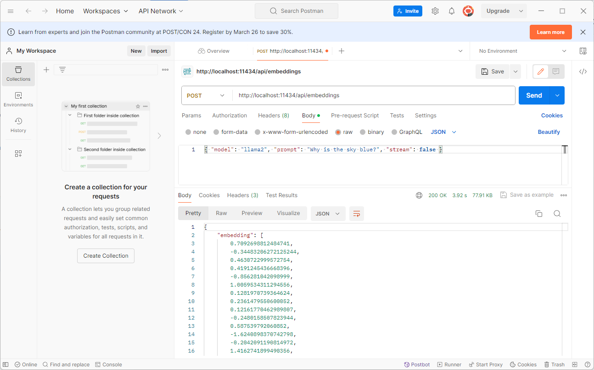

# Ollama

<div class="grid cards" markdown>

-   :material-radar:{ .lg .middle } __Techradar__

    ---

    Trial

-   :material-thumb-up:{ .lg .middle } __Recommendation__

    ---

    Continue with trialling

</div>

> **NOTE**: The use of Ollama is **under review**.

## Overview

LLMs such as OpenAI are accessed through an API, require an account with the model provider and are paid for.

LLMs such as Google’s Gemma, Meta’s Llama and Mistral are available to download and run locally, whether for testing and local development or creating proof of concept systems where cost or online access is an issue.

LLM’s such as Llama can be hosted using the Ollama framework; Ollama is a lightwork framework that allows models to be easily downloaded and run locally. Ollama is downloaded from the [ollama website](https://ollama.com/). It is available to Mac and Windows systems.

Once installed, models can be downloaded and run locally using the ollama cli, e.g:

`$ ollama run llama2`

where llama2 is the model to be run. A full list of models is available [here](https://ollama.com/library).

Once running, the model can be accessed via HTTP on port 11434.

## Accesing The Model

### Via Curl

``` bash linenums="1"
curl http://localhost:11434/v1/chat/completions \n
    -H "Content-Type: application/json" \n
    -d '{
        "model": "llama2",
        "messages": [
            {
                "role": "system",
                "content": "You are a helpful assistant."
            },
            {
                "role": "user",
                "content": "Hello!"
            }
        ]
    }'
```

### Via [Postman](https://www.postman.com/downloads/)



### Via Python

``` py linenums="1"
from openai import OpenAI
client = OpenAI(
    base_url = 'http://localhost:11434/v1',
    api_key='ollama', # required, but unused
)
response = client.chat.completions.create(
  model="llama2",
  messages=[
    {"role": "system", "content": "You are a helpful assistant."},
    {"role": "user", "content": "Who won the world series in 2020?"},
    {"role": "assistant", "content": "The LA Dodgers won in 2020."},
    {"role": "user", "content": "Where was it played?"}
  ]
)
print(response.choices[0].message.content)
```

### Via JavaScript

``` js linenums="1"
import OpenAI from 'openai'

const openai = new OpenAI({
  baseURL: 'http://localhost:11434/v1',
  apiKey: 'ollama', // required but unused
})

const completion = await openai.chat.completions.create({
  model: 'llama2',
  messages: [{ role: 'user', content: 'Why is the sky blue?' }],
})

console.log(completion.choices[0].message.content)
```

### Via Langchain

``` js linenums="1"
import { OllamaEmbeddings } from "@langchain/community/embeddings/ollama"
const embeddings = new OllamaEmbeddings({
    baseUrl: "http://localhost:11434",
    model: "llama2",
    requestOptions: {
        useMMap: true,
        numThread: 6,
        numGpu: 1
    }
})
const documentEmbeddings = await embeddings.embedDocuments(["Hello World!", "Bye Bye"])
console.log(documentEmbeddings)
```